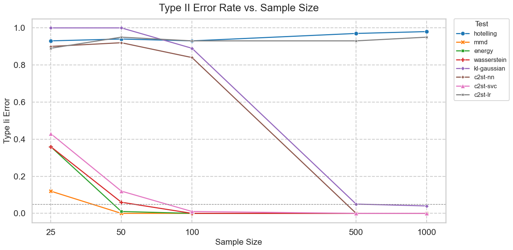
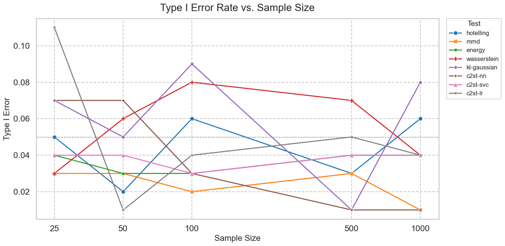
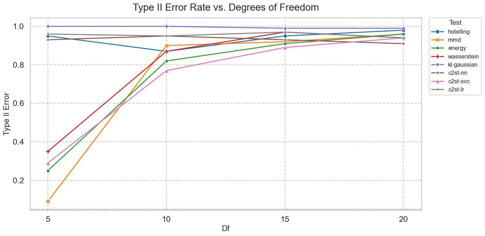

# Type II Error Rates

The goal is to differentiate between the standard Normal and the Student–_t_ distribution with _t_ = 3.

### Hotelling  
Hotelling constantly predicts as if the distributions are the same, because the method is linear and basically checks only the sample mean vector, which is the same in both _P_ and _Q_.

### Logistic Regression  
Logistic regression is linear; the Normal and _t₃_ samples share the same first two moments, differing only in kurtosis. Linear decision rules can’t detect that because you need non-linear features :-(

### C2ST–NN  
A neural network has high capacity and must learn a radial non-linear decision; with small _n_ it usually overfits. Though, once _n_ is large, it generalises and its power matches the kernel/distance tests.

### KL–Gaussian  
KL divergence between two Gaussians depends only on their means and covariances. It seems to work well for large _n_—perhaps because tiny systematic differences in the covariance become detectable as noise decreases. But logistic regression still fails, since it ignores covariance entirely.

---

# Type I Error

When _P_ =_ _Q_, the Type I curves look jumpy (because the task is impossible it’s mostly independent of size):

- We ran each test only 100 times, so even a perfect 5 % error rate will, by chance, produce some false positives.
- NN tests improve with more data, which is likely the reason for its great performance here.
- Hotelling “sees” only mean shifts: both samples have mean ≈ 0, so the error is due to noise.
- Kernel methods capture all moments, including kurtosis; therefore energy and MMD do pretty well.

---

# Effect of Degrees of Freedom

Increasing the _t_ parameter makes the Student–_t_ converge to a Normal distribution. As _t_ → ∞, tail differences vanish, so every method eventually shows zero false negatives :D
